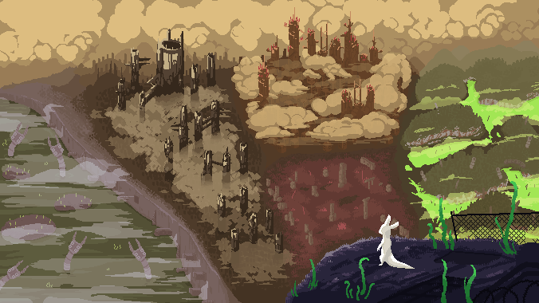

# Rain World Wallpaper Mode



A Rain World mod that transforms the game into a dynamic wallpaper with smooth transitions between random locations.

## Features

- **Single‑Click Launch**: Adds a "Wallpaper Mode" button to Rain World's main menu.
- **Hands‑Free Exploration**: Automatically tours rooms with smooth eased camera transitions.
- **Rain-Based Region Changes**: Regions change automatically when the rain cycle ends - just like the real game. At 85% cycle completion, a random countdown (1-3 min) starts before transitioning to a new region.
- **Lock Room**: Press `L` to lock the camera on your favorite view. Pauses all automatic transitions until unlocked.
- **Chaos Mode**: Spawns creatures to bring the world to life. Configurable intensity (1-10) with optional "Spawn All" for maximum chaos.
- **Echo Support**: Echoes (spiritual beings) can appear in their natural locations with their haunting music.
- **Quick Travel**: Jump instantly to any campaign, region, or specific room via the settings overlay.
- **Camera Modes**: Four camera modes control how views are selected in multi-angle rooms.
- **Overlay & HUD**: F1/Tab opens an in-game settings overlay; HUD shows current room/region, next stop, timers, and control hints.
- **Full Remix Integration**: All settings persist and can be configured from the Remix menu.

## Camera Modes

The mod supports four camera modes that control how camera positions are selected within rooms:

- **Random Exploration** (default) — When entering a room, randomly picks a starting camera position, then randomly decides how many additional jumps to make (0 to N-1 remaining positions). Each jump goes to a random unvisited position in that room, never repeating. Example: In a 6-position room, might start at position 3, then jump to 5, 1, and 6 before moving to the next room. Provides the most dynamic and varied viewing experience.

- **Single Random** — Picks one random camera position per room and immediately moves to the next room. Quick, unpredictable exploration.

- **All Positions** — Shows all camera positions sequentially (1→2→3→4→5→6). Ensures every angle of a room is seen. Comprehensive but predictable.

- **First Only** — Always uses the first camera position (position 0). Fastest room transitions with consistent framing.

Camera mode can be changed in the Remix menu or via the in-game settings overlay (F1/Tab).

## Region Transitions

Region changes are tied to Rain World's day/night cycle for an authentic experience:

- **Normal Mode**: At 85% cycle completion, a random countdown starts (configurable 60-180 seconds by default). When the countdown ends, you transition to a new unvisited region.
- **No Rain Wait Mode**: Skip the countdown entirely - transition instantly at 95% cycle completion.
- **Customizable Timing**: Adjust the min/max countdown range in settings (10-600 seconds).

When all regions in a campaign are visited, the mod automatically advances to the next campaign.

## Chaos Mode

Bring the world to life by spawning creatures:

- **Chaos Level** (1-10): Controls how many creatures spawn. Level 1 is subtle, level 10 is absolute chaos.
- **Spawn All**: Experimental option that ignores the creature blacklist and spawns ALL creature types. May cause instability!

Creatures spawn when entering new rooms. Changes apply on the next region load.

## Controls

| Key | Action |
|-----|--------|
| `D` / `Right Arrow` | Next room |
| `A` / `Left Arrow` | Previous room |
| `Up` / `Down` | Cycle camera positions |
| `L` | Lock/unlock current room |
| `G` | Next region |
| `B` | Previous region |
| `H` | Toggle HUD always visible |
| `F1` / `Tab` | Open settings overlay |
| `Escape` | Return to main menu |

## Installation

1. Ensure you have Rain World v1.9+ (Downpour) installed
2. Install BepInEx if not already installed
3. Copy the entire `mod` folder from `artifacts/bin/RainWorldWallpaperMod/Debug_AnyCPU/mod/` to `RainWorld_Data/StreamingAssets/mods/uzugu.wallpapermod/`
4. Launch Rain World, open the Remix menu, enable “Rain World Wallpaper Mode”, and apply changes (a restart is required)

## Development

### Prerequisites

- .NET SDK
- Rain World game files
- BepInEx

### Building

```bash
dotnet build
```

The compiled mod will be in `artifacts/bin/RainWorldWallpaperMod/debug_win-x86/mod/`

### Setup

Before building, you need to copy the following DLLs from your Rain World installation to the `lib/` folder:

- `UnityEngine.dll` (from `RainWorld_Data/Managed/`)
- `Assembly-CSharp.dll` (from `RainWorld_Data/Managed/`)
- `HOOKS-Assembly-CSharp.dll` (from `BepInEx/plugins/`)

## Configuration

Two configuration surfaces are available:

### Remix Menu (Main Menu → Options → Remix → Rain World Wallpaper Mode)

| Setting | Description | Default |
|---------|-------------|---------|
| Campaign | Which slugcat campaign to explore | Survivor |
| Start Region | Initial region to load | Outskirts |
| Camera Mode | How camera positions are selected | Random Exploration |
| Room Stay (sec) | Time in each room before transitioning | 15 |
| Transition (sec) | Camera transition duration | 5 |
| Rain Min/Max (sec) | Countdown range before region change | 60-180 |
| No Rain Wait | Skip countdown, instant transition at 95% | Off |
| Show HUD | Keep HUD always visible | On |
| Enable Echoes | Allow echoes to spawn | On |
| Chaos Mode | Spawn creatures | Off |
| Chaos Level | Creature spawn intensity (1-10) | 1 |
| Spawn All | Ignore creature blacklist (experimental) | Off |

### In-Game Overlay (`F1` / `Tab`)

Access all settings while in wallpaper mode:
- Quick Travel: Jump to any campaign, region, or room
- Toggle Lock Room, Chaos Mode, No Rain Wait
- Adjust Chaos Level
- All changes apply immediately


## License

Apache-2.0

## Credits

Inspired by Rain World's Safari mode by Videocult.
