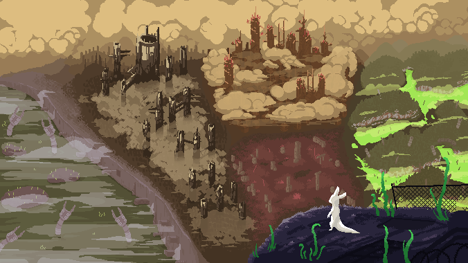

# Rain World Wallpaper Mode



Rain World Wallpaper Mode turns Rain World into a hands-free animated wallpaper. It launches directly from the main menu, tours rooms automatically, changes regions with the rain cycle, and exposes live controls for camera, HUD, chaos, and quick travel.

## Features

- Main-menu `WALLPAPER MODE` launch button
- Automatic room exploration with smooth eased camera transitions
- Rain-cycle-driven region changes
- Four camera modes for multi-camera rooms
- In-game settings overlay and quick travel
- Auto-hiding or always-visible HUD
- Optional chaos spawning with configurable intensity
- Natural echo support with echo music handling
- Remix configuration for persistent defaults

## Quick Start

1. Enable the mod in Remix.
2. Return to the main menu.
3. Click `WALLPAPER MODE`.
4. Use `F1` or `Tab` for the in-game settings overlay.

For the full control reference, see `HOW_TO_USE.md`.

## Wallpaper Engine

The integration path is to run Rain World as an application wallpaper while this mod is installed and enabled.

Recommended launch arguments:

```text
--wallpaper --wallpaper-region SU --wallpaper-campaign White
```

Notes:

- `--wallpaper` boots straight into wallpaper mode with no menu click.
- `--wallpaper-region <code>` overrides the starting region for that launch only.
- `--wallpaper-campaign <name>` overrides the campaign for that launch only.
- The auto-launch is one-shot per process, so returning to the main menu does not immediately relaunch wallpaper mode.

For setup details, see `WALLPAPER_ENGINE.md`.

## Controls

| Key | Action |
| --- | --- |
| `Right Arrow` / `D` | Next room |
| `Left Arrow` / `A` | Previous room |
| `Up Arrow` / `W` | Next camera position |
| `Down Arrow` / `S` | Previous camera position |
| `N` | Immediate random room change |
| `G` | Next region |
| `B` | Previous region |
| `L` | Toggle room lock |
| `H` | Toggle HUD always visible |
| `F1` / `Tab` | Toggle settings overlay |
| `Escape` | Return to main menu |

## Camera Modes

- `Random Exploration`: random starting camera plus optional extra jumps to unvisited camera positions in the same room
- `Random`: one random camera position per room
- `Sequential`: every camera position in order
- `First Only`: always camera position `0`

## Region Logic

Region changes are tied to the rain cycle:

- Standard mode starts a random countdown once the cycle reaches 85%.
- `No Rain Wait` changes regions immediately at 95%.
- After all regions in the current campaign have been visited, the mod advances to the next campaign.

## Installation

1. Install Rain World and BepInEx.
2. Build the project.
3. Copy the packaged mod output into `RainWorld_Data/StreamingAssets/mods/<your-mod-folder>/`.
4. Confirm the installed folder contains:
   - `modinfo.json`
   - `plugins/RainWorldWallpaperMod.dll`
5. Launch Rain World and enable the mod in Remix.

Build output location:

`artifacts/bin/RainWorldWallpaperMod/<Configuration>_AnyCPU/mod/`

## Development

### Prerequisites

- .NET SDK with .NET Framework 4.8 targeting support
- Rain World game files
- BepInEx

### Required Local DLLs

Copy these into `lib/` before building:

- `UnityEngine.dll`
- `UnityEngine.CoreModule.dll`
- `UnityEngine.InputLegacyModule.dll`
- `Assembly-CSharp.dll`
- `HOOKS-Assembly-CSharp.dll`

### Build

```bash
dotnet build -c Debug
dotnet build -c Release
```

The project packages the DLL and `assets/` into:

`artifacts/bin/RainWorldWallpaperMod/<Configuration>_AnyCPU/mod/`

## Configuration

### Remix Options

The Remix UI exposes:

- campaign
- start region
- camera mode
- room stay duration
- transition duration
- HUD fade delay
- always-show HUD
- echo enable
- chaos mode
- chaos level
- spawn all
- no-rain-wait
- rain countdown min/max

### In-Game Overlay

The overlay exposes the live wallpaper session:

- campaign quick travel
- region quick travel
- camera mode changes
- room quick travel
- room lock
- chaos toggles
- no-rain-wait toggle

## Documentation

- `HOW_TO_USE.md`: current user guide
- `ARCHITECTURE.md`: file map and runtime architecture
- `WALLPAPER_ENGINE.md`: external-app wallpaper setup and launch arguments
- `WORKSHOP_PUBLISHING.md`: publishing checklist for Steam Workshop
- `DESIGN.md`: historical design/planning document

## License

Apache-2.0

## Credits

Inspired by Rain World's Safari mode by Videocult.
